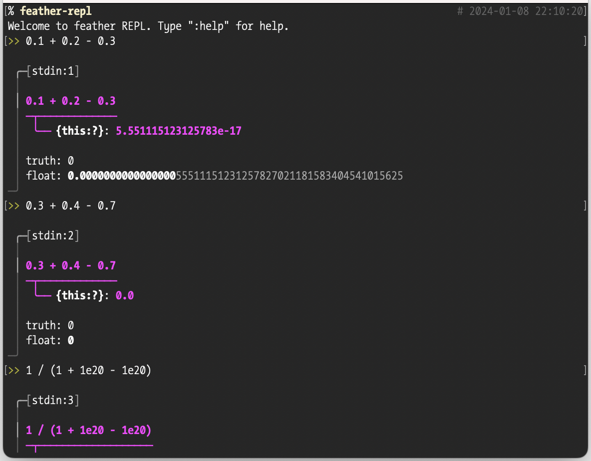
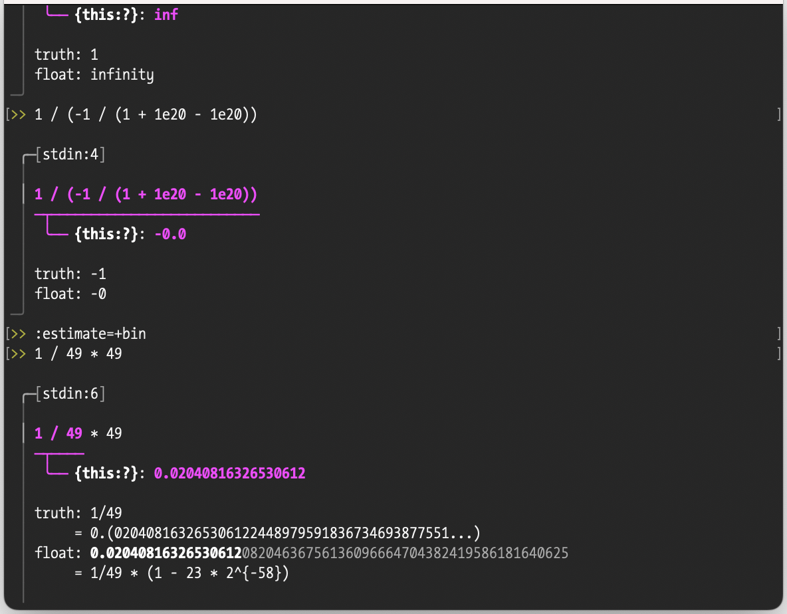
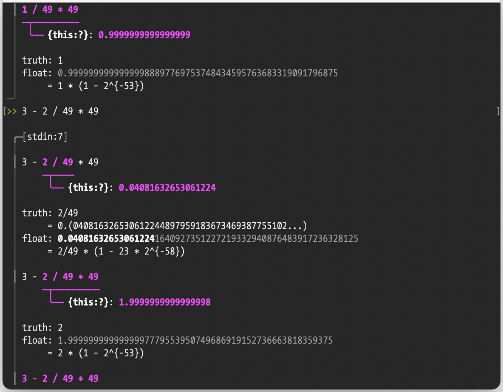
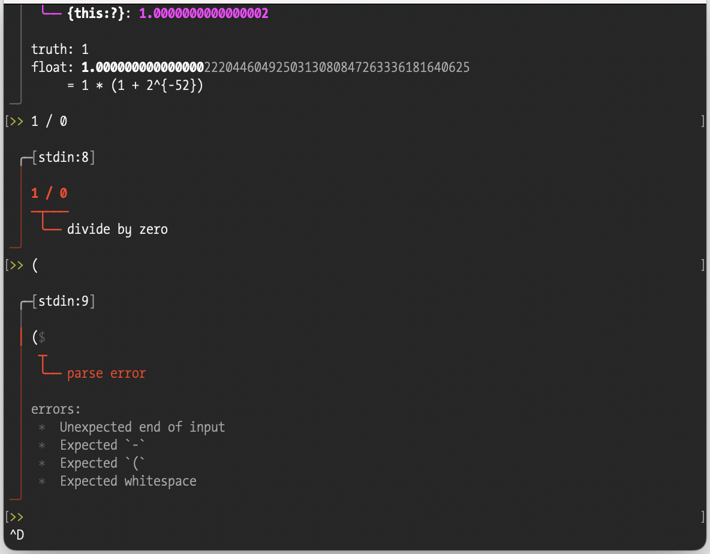
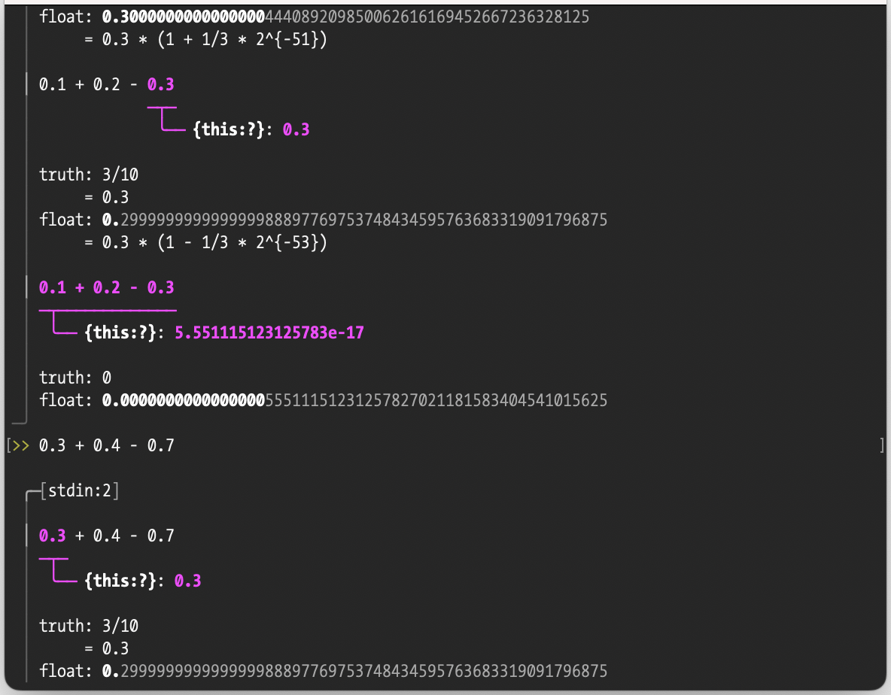
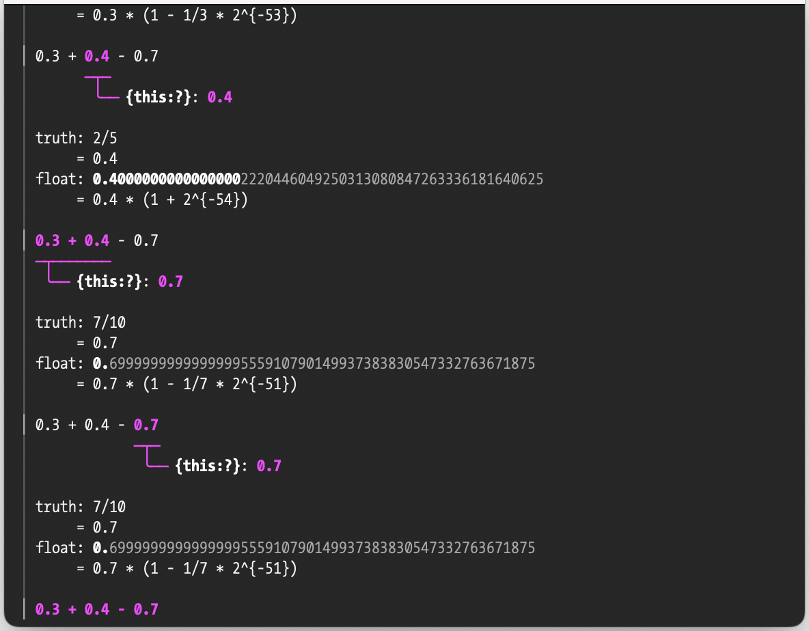
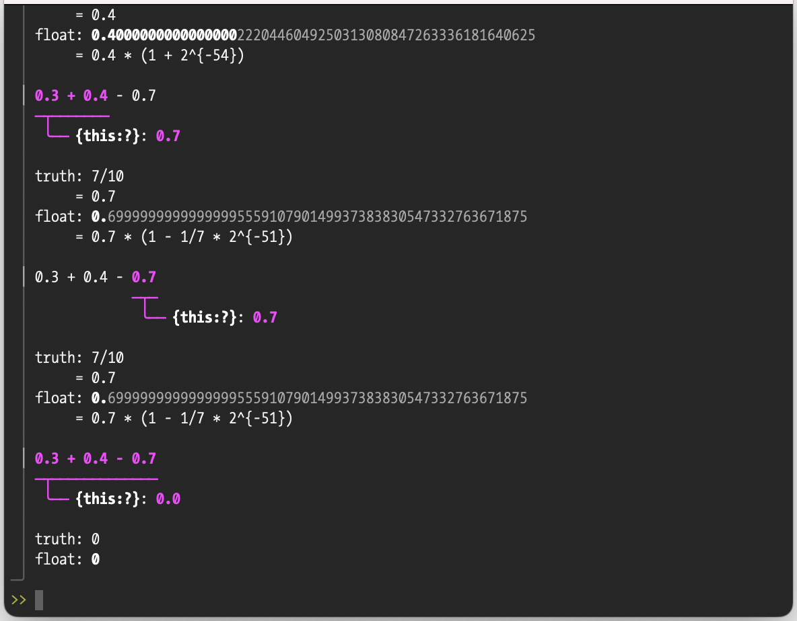

# feather-repl :feather:
A REPL for the *f*loating-point *e*rror *a*nalysis with *the* *r*ational-number calculation.

> **feather** /ˈfɛðə/
>
> *verb*: float or move like a feather.

:eyes: :sparkles:

## Usage

### Prerequisites

Install [`git`](https://www.git-scm.com/downloads) and [`cargo`](https://rustup.rs/) (Rust).

### Installation

```sh
% cd /path/to/working/dir  # replace appropriately
% git clone git@github.com:rsk0315/feather-repl.git
% cargo install --path feather-repl
% hash -r  # if needed
```

### Execution

```sh
% feather-repl
```

## Screenshots















